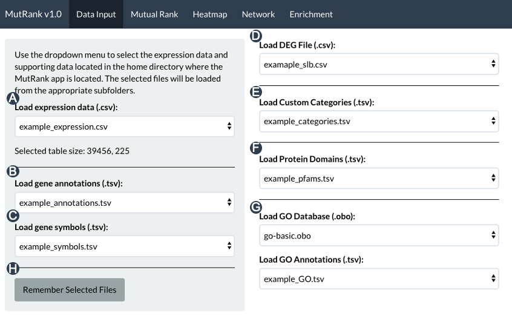
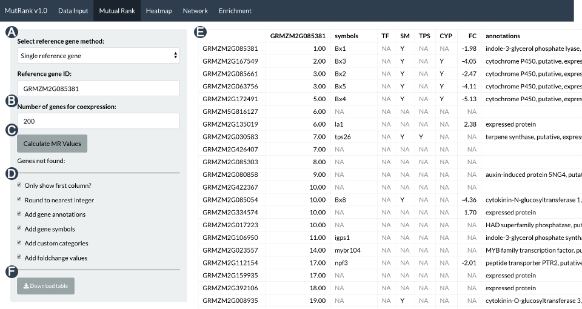
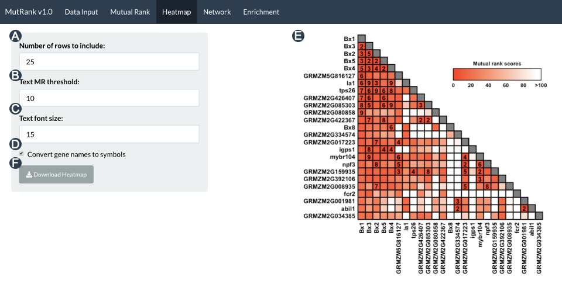
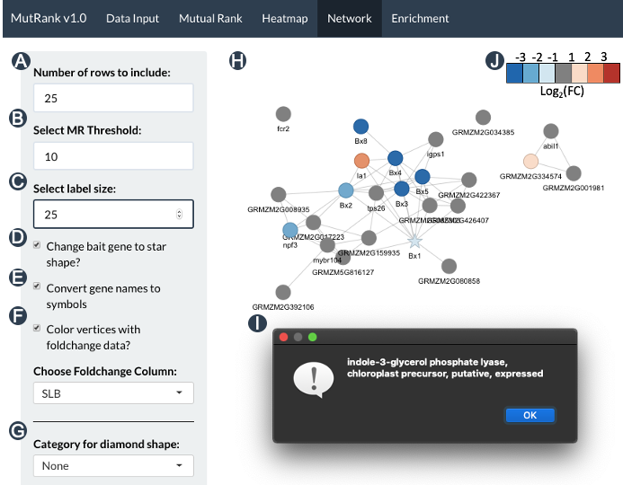

# MutRank 

# Note
Due to potential dependency issues with Hypergea I have included a minimal version of MutRank (MutRank-1.1-minimal.zip)
that includes only the data input and mutual rank analysis tabs. I will replace the Hypergea hypergeometric test method
with a different one to avoid this issue in the future.

# Introduction
Transcriptomic data can uncover complex biological processes in part through the improved understanding of gene 
coexpression patterns. Mutual Rank (MR), the geometric mean of the ranked Pearson’s Correlation Coefficient (PCCs) 
between a pair of genes was shown to be a better indicator of functional associations and produces more robust 
results when using raw data compared to PCC. It was demonstrated that MR analyses of transcripts should be favored 
in the prediction pathway gene functions and serve as springboard for hypothesis testing and validation. We 
developed an R Shiny web-application, termed MutRank, to facilitate user control over both targeted and non-targeted 
MR-based coexpression analyses for rapid hypothesis testing. In addition to identifying highly coexpressed genes 
in any user-provided expression dataset, MutRank automatically integrates supporting information such as gene 
annotations, differential-expression data, predicted domains and assigned GO terms and provides useful tabular 
and graphical outputs as foundation for empirical hypothesis testing. The goal of MutRank is to provide simple, 
customizable and readily accessible tools to speed research progress in connecting metabolic phenotypes to genotypes 
for the purpose of understanding biological roles. 

# Requirements

* `R` - https://cran.r-project.org/src/base/R-3/ 
* `R Stduio` -  https://rstudio.com/products/rstudio/download/ 
* `Java` (requires restarting) - https://java.com/en/download/

# Installation

1. Download ZIP or clone MutRank from: https://github.com/eporetsky/mutRank 
2. Unzip and open the `app.R` file using R Studio
3. To start MutRank press the `Run App` button in R Studio 
4. Follow the R instructions to install required R libraries
5. Start using MutRank in the browser or window mode 
* MutRank automatically handles installation of required R libraries

# R Dependencies

MutRank will automatically install the packages listed below when when starting the app. The app was tested on windows, linux and macOS with the listed library versions.
* hypergea_1.3.6 
* ontologyIndex_2.5 
* reshape2_1.4.3 
* RColorBrewer_1.1-2 
* data.table_1.12.8 
* ggplot2_3.3.0 
* visNetwork_2.0.9 
* igraph_1.2.4.2 
* shinythemes_1.1.2 
* shiny_1.4.0.2

# Folders and Example Data Sources

* data - Expression data (doi: 10.3835/plantgenome2015.04.0025)
* annotations - Text annotations of genes (https://phytozome.jgi.doe.gov/pz/portal.html)
* symbols - Gene symbols (https://maizegdb.org/gene_center/gene)
* foldchange - Log2 Foldchange data (doi: 10.1038/s41477-019-0509-6)
* categories - Categories assigned to genes, Pfam domains and GO terms  
(doi: 10.1038/s41477-019-0509-6, doi: 10.1105/tpc.17.00009)
* domains - Genes with their predicted domains (https://phytozome.jgi.doe.gov/pz/portal.html)
* GO - GO database (http://geneontology.org/docs/download-ontology/) and  
assigned terms (https://phytozome.jgi.doe.gov/pz/portal.html)

# File Formats Used

1. Comma-separated values (.csv): Expression and differential expression data 
2. Tab-separated values (.tsv) - Annotations, symbols, Pfam domains, GO assignments and custom cetegories
3. Ontology file (.OBO) - Downloaded from http://geneontology.org/docs/download-ontology/

# Guide to Using MutRank

## `Data Input` Tab

The Data Input tab is the first tab of the MutRank app in which users can load their expression data and supporting information for MR-based
coexpression analyses (Fig. 1). The only requires to conduct MR-based coexpression analyses is the expression data. Additional user-provided 
supporting information will be automatically integrated with the coexpression results. When the MutRank app starts, each data folder is parsed 
to find all files with the expected filename extensions and these files are listed in their relevant dropdown menus. A short delay is expected 
when loading large expression files, but a short text output containing the table dimensions will update once the expression data file is 
loaded (Fig. 1A). Non-expressed genes (zero sum expression) are automatically filtered to prevent error messages. User provided supporting 
information includes gene annotations (Fig. 1B), gene symbols (Fig. 1C), differential expression data (Fig. 1D), custom categories (Fig. 1E),
protein Pfam domain annotation (Fig. 1F) and the Gene Ontology (GO) database file along the GO assignments (Fig. 1G). By default MutRank 
starts with loading the example files but this can be changed by pressing the "Remember Selected Files" button.

## `Mutual Rank` Tab

Once the expression data and supporting information are loaded the MR-based coexpression analyses can start (Fig. 2). First, the user should select 
one of 3 possible reference gene methods: (1) Single reference gene, (2) compound reference gene or (3) reference gene list and then insert a 
reference or gene list (Fig. 2A). The compound reference gene method creates a new compound reference gene from the calculated average, sum, maximum 
or minimum expression values of the reference gene list. The reference gene list method calculates the MR values between the genes in the list using
the first gene in the list as the primary referenece gene. Gene lists can be separated by: tab, new line, vertical tab, space and comma. By default
MutRank will find the 200 coexpressed genes using Pearson’s Correlation Coefficient (PCC) values (Fig. 2B) to generate the list of genes for which
MR values will be calculated. This practical trade-off between whole genome and targeted coexpression analyses allows MutRank to rapidly complete the 
analysis and to run on the resources of most personal computers. MR values will be calculated after pressing the "Calculate MR Values" button (Fig. 2C). 
Additional settings allow the user format the coexpression results and to integrate supporting information (Fig. 2D). The final results will be 
presented in the MR-based coexpression table in the main panel (Fig. 2E) which can be downloaded as a tsv file using the 'Download Table' button (Fig. 2E).

In the example below (Fig. 2) we selected the maize reference gene GRMZM2G085381 (Bx1).

## `Heatmap` Tab

The MR-based coexpression table generated in the Mutual Rank tab can be used to generate a heatmap graphical output in the Heat Map tab (Fig. 3).
We set the maximum number of genes to be presented using the heatmap at 25 to keep it intelligible. We have included a few options that allow users
to modify the heatmap figure, including the number of genes to included in the heatmap (Fig. 3A), the maximum MR value to be included as text within
the heatmap (Fig. 3B), the text size (Fig. 3C) and an option to convert gene IDs to gene symbols, when applicable (Fig. 3D). The red-to-white color 
gradient is used to represent the MR values and is set to represent MR values between 1 and 100 with all values higher than 100 set to a white color.
The heatmap presented in the main panel (Fig. 3E) can be downloaded as a PNG file using the 'Download Heatmap' button (Fig. 3F).

## `Network` Tab

The MR-based coexpression table generated in the Mutual Rank tab can be used to generate a coexpression network (Fig. 4). First, the MR-based 
coexpression table is converted to an adjacency matrix using igraph which is used to annotate the gene nodes with the supporting information. 
Users can select how many of the top coexpressed genes to include in the network (Fig. 4A), the MR threshold to connect to gene vertices with an
edge (Fig. 4B), the size of the text labels (Fig. 4C), wether to to convert the shape of reference gene vertex to a star (Fig. 4D) and wether to 
convert the gene IDs of each node to gene symbols, when applicable (Fig. 4E). Differential expression values can be integrated by selecting one of the
columns from the data to change the color of the gene nodes (Fig. 4F). Custom categories can be integrated by changing the shape of the gene nodes 
to one of 5 shapes: (1) diamond, (2) start, (3) triangle, (4) down-triangle or (5) square (Fig. 4G). If a gene belongs to more than one custom 
category it will take the shape of the last shape it belongs to from the previous list. When available, gene annotations are automatically integrated. 
After assigning all these attributes to the nodes using igraph, the igraph network is converted to a dynamic java-script-based netowrk visualization 
using the vizNetwork package (Fig. 4H). Gene annotations can accessed by pressing on any of the gene nodes to trigger a pop-up text message (Fig. 4I).
Differential expression data is visualized as an incremental gradient between log2 fold-change of -3 and 3. The gradient scale (Fig. 4J) was added manually
and is available as a separate image in the "img" folder under the "DEG_gradient.png" file name. 

## `Enrichment` Tab

The MR-based coexpression table generated in the Mutual Rank tab can be tested for Gene Ontology (GO) enrichment. We use the hypergeometric test
using the selected GO database to calculate the P-values for GO term enrichment (Fig. 5). In the side panel users can select MR threshold that will
be used to include genes for the enrichment analysis (Fig. 4A). Users can also choose to include in the final table, for each GO term, the 
non-adjusted p-values, the values used for the hypergeometric test and the list of genes included in the analysis (Fig. 5B). The column names used for
the values used for the hypergeometric test are: "N" - Number of genes in the GO annotation files; "M" - Number of genes annotated with specific GO
term; "n" - Number of included genes from the coexpression table; "m" - Number of included genes from the coexpression table that are annotated with
the specific GO term. Users can also select which method (holm, hochberg, hommel, bonferroni, BH or BY) to use to adjust the P-value for false-discvery 
rate (FDR) (Fig. 5C). The GO enrichment table presented in the main panel (Fig. 5D) can be downloaded as a PNG file using the 'Download Table' 
button (Fig. 3E).

