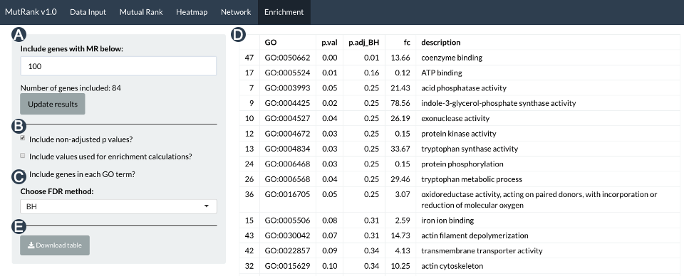

\tableofcontents

\pagebreak

# 1. Introduction

With reduced cost and increased accessibility of next generation sequencing technologies, public and private custom large scale transcriptomic datasets are now commonly analyzed by many laboratories. For example, in plants many studies and online databases combine numerous transcriptomic samples from species, genotypes, developmental stages, tissues and physiological conditions to understand traits of agronomic significance.  The publication of transcriptomes from thousands of plant species are expected to speed large-scale transcriptomic experiments in non-model organisms. Transcriptomic data can help unravel complex biological processes in part through understanding gene coexpression analyses. Often genes that function within similar pathways are more likely to be transcriptionally coregulated and can be used to predict functional associations and putative gene function. 

Many databases and webtools have been developed to facilitate coexpression analyses and many of them use the Pearson’s Correlation Coefficient (PCC) as a measure of coexpression. Mutual Rank (MR), the geometric mean of the ranked PCCs between a pair of genes, has been proposed as an alternative measure of coexpression to PCC. MR was shown to be better at predicting gene function compared to PCC independent of how the PCC coexpression database was constructed and of the reference gene tested. When the MR- and PCC-based coexpression databases of multiple plant species were converted into coexpression networks, the MR-based coexpression networks were more comparable than PCC-based coexpression networks across species using different metrics. Clustering of the MR-based networks produced clusters that were enriched for enzymes associated with plant specialized metabolism pathways. Confirmed through diverse empirical approaches, targeted MR-based coexpression analyses were recently leveraged as powerful tools enabling the narrowing of candidates and accurate prediction of specialized maize metabolic enzymes within the kauralexin and zealexin pathways.

Despite the usefulness of existing coexpression databases few databases enable flexible hypothesis testing and tool-based simplicity integrating user-provided expression data and supporting information. Integrating user-provided supporting information with coexpression results can facilitate the prediction of meaningful functional associations and tentative assignment of putative gene functions. We developed a R Shiny web-application, termed MutRank, to facilitate exploratory targeted MR-based coexpression analyses. Using the R Shiny framework allowed for the design of a coexpression analysis platform that utilizes useful R packages in addition to incorporating user-provided expression data and supporting information. A web-application is also advantageous for generating a highly customizable and easy-to-use interface that can run on most personal computers. In addition to identifying the most highly coexpressed genes in any user-provided expression dataset, MutRank integrates supporting information such as gene annotations, differential-expression data, predicted domains and assigned GO terms and provides useful tabular and graphical outputs as foundation for empirical hypothesis testing. 

# 2. Getting Started

## 2.1 Requirements
* `R` - https://cran.r-project.org/src/base/R-3/
* `R Stduio` -  https://rstudio.com/products/rstudio/download/
* `Java` (requires restarting) - https://java.com/en/download/

## 2.2 Installation

1. Download or clone MutRank from: https://github.com/eporetsky/mutRank
2. Unzip and open the `app.R` file using R Studio
3. To start MutRank press the `Run App` button in R Studio
4. Start using MutRank in the browser or window mode
* When MutRank first starts it installs and loads required R libraries

## 2.3 R Dependencies

MutRank will automatically install these packages when you start it for the first time.

* hypergea_1.3.6
* ontologyIndex_2.5
* reshape2_1.4.3
* RColorBrewer_1.1-2 
* data.table_1.12.8
* ggplot2_3.3.0
* visNetwork_2.0.9
* igraph_1.2.4.2
* shinythemes_1.1.2
* shiny_1.4.0.2

## 2.4 Data Preparation

The MutRank folder contains a separate folder for each of the supported data type. Files in these folders will be automatically included in the dropdown menu for data input field and loaded once selected. We also included an option to upload files manually (this was included for running MutRunk on as Shiny Server instance where users might not have access to the folders). Once you have selected the files to load you can press the `Save Default` button so the same files will be automatically loaded next time you start MutRank (default settings are saved in the main folder in `default_files.csv`).

#### File formats
1. Comma-separated values (csv): Expression and differential expression data
2. Tab-separated values (tsv) - Annotations, symbols, Pfam domains, GO assignments and custom cetegories

\pagebreak

# 3. Navigating the MutRank Tabs

## 3.1 Main `Data Input` Tab

Data Input is the first tab to appear when you start MutRank. MutRank only requires expression data to preform basic coexpression analyses and will integrate any supporting information to facilitate prediction of putative gene functions. If the expression data and supporting information files are correctly formatted that will appear in the appropriate selection box in the Data Input tab (Fig. 1), make sure that the files have the correct suffix and file format. Looking at the example files might also be helpful at solving certain problems. 

{ width=90% }

\pagebreak

## 3.2 `Mutual Rank` Tab

The Mutual Rank tab contains the main interface for calculating the MR-based coexpression table using user-provided expression data and supporting information files. 

\pagebreak

## 3.3 Coexpression `Heatmap` Tab

The coexpression heatmap is generated using ggplot2. Use the side panel to 

\pagebreak

## 3.4 Coexpression `Network` Tab

The coexpression network is created using igraph and converted to a dynamic java-script netowrk using vizNetwork package. Use the side panel to edit the final network to show specified aspects of the supporting information. 

\pagebreak

## 3.5 GO `Enrichment` Tab

GO enrichment is calculated using a hypergeometric test. 

If you choose to view the values used to for enrichment calculations,

\pagebreak

# 4. Example Workflows

## 4.1 Coexpression analysis of the maize benzoxazinoid-biosynthesis pathway

Benzoxazinoids (Bxs) are a highly studied class of maize specialized metabolites involved in defense against herbivores and pathogens. 

![Coexpression analysis of the maize benzoxazinoid-biosynthesis pathway - (A) The Bx biosynthetic pathway includes a series of characterized enzymes (Bx1-14) that were used as a reference gene list (Bx6-7 are not in the expression data and were not included) to calculate the MR values between all the Bxs (1). Users can select the the coexpression data and supporting information (2) that will be integrated and presented in the coexpression table (3). The results of the coexpression analysis can be presented as coexpression heatmap in the Heatmap panel (B) and and coexpression network in the Network panel (C) to show that among the 12 Bxs we included in the reference gene list, using an MR threshold of 100 to draw an edges between genes, we can find 2 clusters of highly-coexpressed Bxs that include 9 of the 14 genes in the original list.](img/figure_bxs.png)

\pagebreak

## 4.2 Coexpression analysis of the maize kauralexin-biosynthesis pathway

Maize specialized metabolites in specific diterpenoid pathways have been implicated in diverse protective roles providing fungal, insect and drought resistance.

![Coexpression analysis of the maize kauralexin-biosynthesis pathway - (A) Characterizing of the the maize kauralexin-biosynthesis pathway leveraged targeted MR-based coexpression analyses. We used ZmAN2, one of the known genes responsible for catalyzing a key pathway precursor, as a single reference gene to calculate the MR values for the top 200 most highly coexpressed genes (based on PCC) and integrated the results with the supporting information. We selected the top 15 most highly coexpressed genes (based on MR) in the table to generate (B) a coexpression heatmap and (C) a coexpression network figure to show a cluster of coexpressed TPSs (ZmAN2 and ZmKSL2, diamond shape vertices) and CYPs (ZmKO2 and ZmCYP71Z18, square shaped vertices), their induced expression 24 hours after SLB treatment. (D) GO enrichment analysis of genes with MR<100 included 124 genes. Term enrichment P-values were calculated with a hypergeometric test using the full GO database and P-values were adjusted using the Bonferroni–Holm method. GO enrichment results indicate that the genes coexpressed with ZmAN2 are involved in biotic stress responses. ](img/figure_kaurs.png)

\pagebreak

# 5. Acknowledgements

We would also like to thank the contributors of the cited R packages.

# 6. License

MutRank is available under the...